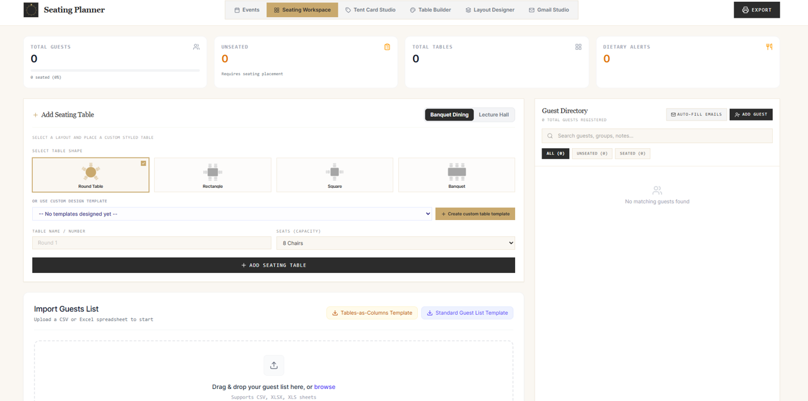

# Event Seating Planner

A full-stack, interactive banquet seating and floorplan management web application. Easily design venue layouts, organize table geometries, assign guests, generate foldable tent cards, and export print-ready event assets.

---

## Preview



---

## Features

* **Interactive Seating Arena:** SVG floorplan with drag-and-drop seating, instant guest swapping, upright seat numbers, and dual Banquet Dining / Lecture Hall modes.
* **Events Manager & Setup Wizard:** Multi-event workspace with a 6-step guided wizard and in-place event summary editing.
* **Dynamic Table Builder Studio:** Design custom table shapes (Circle, Rectangle, Square, Oval, Polygon, etc.) with automatic seat distribution and custom role tags (VIP, Wheelchair, Standard).
* **Room Layout Designer:** Architectural planner for placing walls, doors, windows, stages, and custom labels with quick delete controls.
* **Foldable Tent Card Studio:** Generate print-ready double-sided tent place cards with custom fonts and folding guides.
* **Invitation Studio:** Rich-text WYSIWYG editor with image cropping and optional Gmail API dispatch.
* **Print & PDF Exports:** Export high-DPI visual floorplans, alphabetical directories, and individual table cards without timestamp clutter.

---

## 🚀 Quick Start

### 1. Installation
```bash
git clone <repository-url>
cd event-seating-planner
npm install
```

### 2. Configuration (`.env`)
Create a `.env` file in the root directory (or copy from `.env.example`):

```env
# --------------------------------------------------
# 1. Core Server Settings (Required)
# --------------------------------------------------
PORT=3000

# --------------------------------------------------
# 2. Gmail Invitation & Admin Module (Optional)
# Required ONLY if you want to use Gmail email dispatch.
# If omitted, all floorplan, table, and PDF export features work normally.
# --------------------------------------------------

# Session encryption (min 16 characters)
SESSION_SECRET="your_random_session_secret_key_min_16_chars"

# Admin dashboard password hash (generate with: node scripts/set-admin-password.js)
ADMIN_PASSWORD_HASH="$2a$12$yourBcryptHashHere"

# AES-256 token encryption key (32-byte base64url string)
# Generate with: node -e "console.log(require('crypto').randomBytes(32).toString('base64url'))"
OAUTH_ENCRYPTION_KEY="your_32_byte_base64url_key"

# App base URL for OAuth callbacks
APP_URL="http://localhost:3000"

# Google Cloud OAuth 2.0 Credentials (from Google Cloud Console > APIs & Services > Credentials)
GOOGLE_CLIENT_ID="your_google_oauth_client_id.apps.googleusercontent.com"
GOOGLE_CLIENT_SECRET="GOCSPX-your_google_oauth_client_secret"
GOOGLE_REDIRECT_URI="http://localhost:3000/api/auth/google/callback"
```

### 3. Run
```bash
# Development mode
npm run dev

# Production build & start
npm run build
npm start
```

Access the app at **`http://localhost:3000`**.

---

## ⚙️ Environment Variables Reference

| Variable | Required? | Description |
| :--- | :--- | :--- |
| `PORT` | **Yes** | Port number for the Express server (default: `3000`). |
| `SESSION_SECRET` | *Optional\** | Secret string used to sign session cookies for admin login (min 16 characters). |
| `ADMIN_PASSWORD_HASH` | *Optional\** | Bcrypt hash (Cost 12) for the invitation admin dashboard. Generated via `node scripts/set-admin-password.js`. |
| `OAUTH_ENCRYPTION_KEY` | *Optional\** | 32-byte base64url key used for AES-256-GCM encryption of stored Gmail OAuth tokens at rest in SQLite. |
| `APP_URL` | *Optional\** | Base URL of the hosted application (e.g. `http://localhost:3000`), used for OAuth redirection. |
| `GOOGLE_CLIENT_ID` | *Optional\** | Google OAuth 2.0 Client ID obtained from Google Cloud Console. |
| `GOOGLE_CLIENT_SECRET` | *Optional\** | Google OAuth 2.0 Client Secret obtained from Google Cloud Console. |
| `GOOGLE_REDIRECT_URI` | *Optional\** | OAuth redirect URI matching your Google Cloud Console authorized redirect URIs. |

> **\*** *These variables are only required if you use the **Gmail Invitation Dispatch** feature. If omitted, the app automatically runs in standalone mode with Gmail broadcast disabled while all seating floorplan and PDF export features remain fully functional.*

---

## 🔒 Privacy

All seating layouts, tables, and guest records are stored **locally in your browser (`localStorage`)**. No event data is transmitted to external servers.
